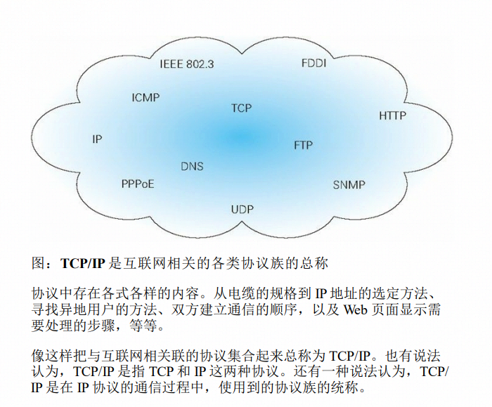
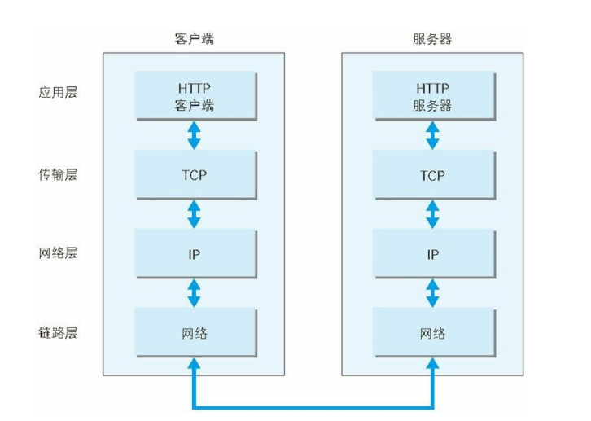
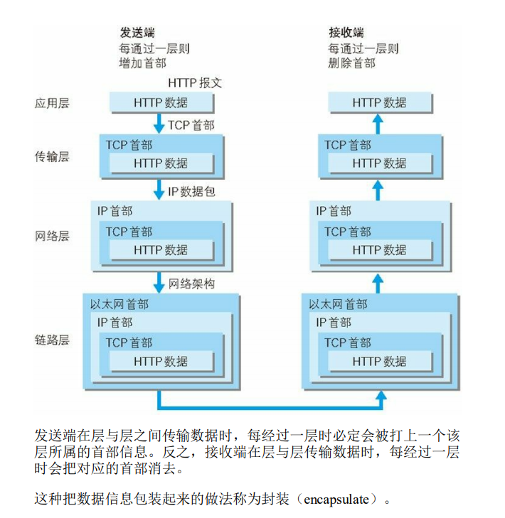
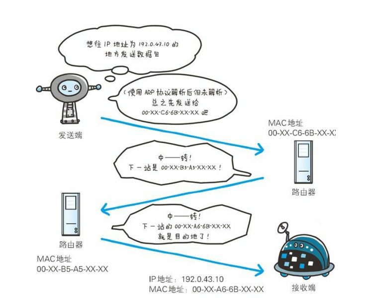
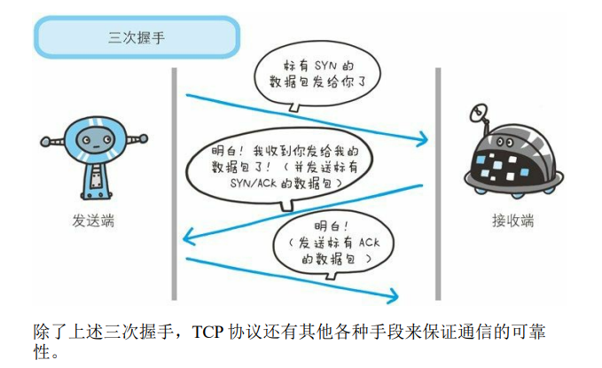
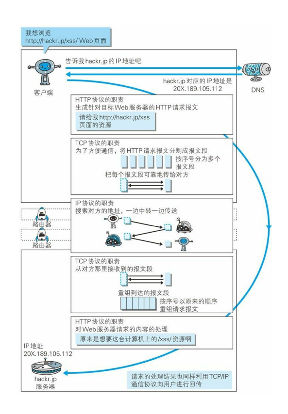

# TCP/IP协议族
* http只是它其中一个子集
* 用来确定计算机和网络设备相互通信的方法。比如，如何探测到通信目标、由哪一边先发起通信、使用哪种语言进行通信、怎样结束通信等规则都需要事先确定。不同的硬件、操作系统之间的通信，所有的这一切都需要一种规则。而我们就把这种规则称为协议（protocol）。

# TCP/IP分层
1. 应用层（http在这层）
    * TCP/IP协议族内提供了各类通用的应用服务，这层则决定向用户提供应用服务时通信活动，比如：FTP文件传输协议,DNS域名系统,HTTP协议
2. 传输层
    * 提供处于网络连接中的两台设备进行数据传输
    * 这层有两个不同性质的协议，TCP传输控制协议，UDP用户数据报协议
3. 网络层/网路互联层
    * 提供将网络上流动的数据包，选择一条线路传给对方设备
4. 数据链路层/链路层/网络接口层
    * 用来连接硬件设备
* 分层好处是某个地方要改，不至于全部都改，只要改相应的层次就行

# TCP/IP通信传输流

# IP,TCP,DNS与HTTP
1. IP（网际协议）-负责传输
    * 位于网络层，作用是把各种数据包，通过ip地址传送给对方。
    * 传送时要满足的两个重要条件IP地址（节点分配的地址）和MAC地址（网卡的固定地址）。
    * ARP可以凭借MAC地址通信
    
2. TCP协议-确保可靠性
    * 处于传输层，采用三次握手策略
    * 握手过程中使用TCP标志，SYN和ACK。
        1. 发送端发送带有SYN的数据包
        2. 接收端接收到数据包然后，返回一个带有SYN与ACK的数据包
        3. 发送端接收到到回包，发送带有ACK的数据包给接收端，表示握手结束
    * 握手阶段如果莫名中断了，会重新按顺序发送相同的数据包
    

3. DNS-负责域名解析
    * 位于应用层，提供域名和IP地址的解析服务
    * 可以正反解析
    