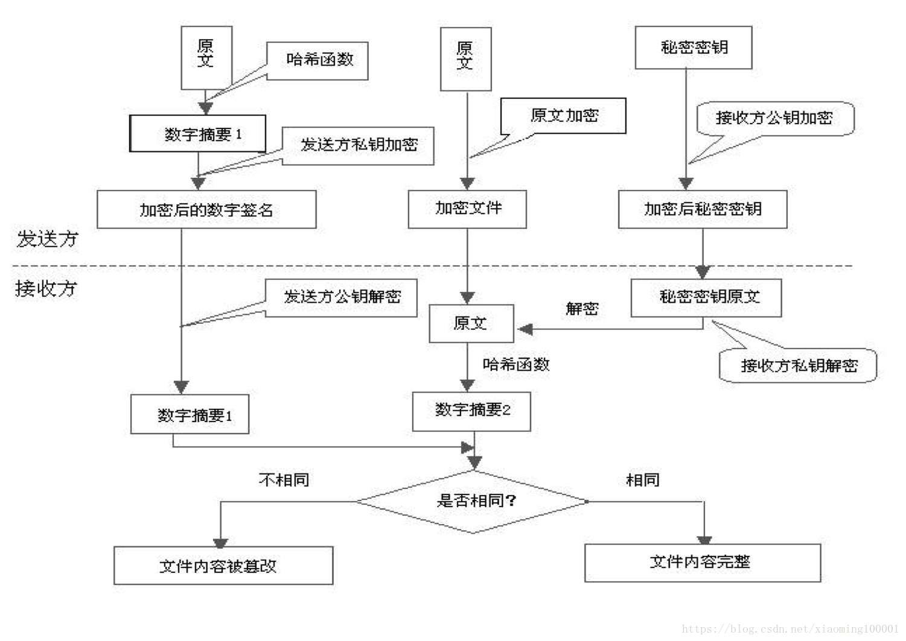

# HTTPS
披着SSL外壳的HTTP,一种计算机网络通信的安全协议，由HTTP进行同行，利用SSL/TLS建立安全信道，加密数据包。
#### 特点
1. 内容加密，中间中间者无法看到明文内容
2. 验证身份，通过证书认证客户端访问的是自己的服务器
3. 保护数据的完整性，防止被中间者冒充或者篡改
#### 安全措施
* 混合加密：结合非对称加密和对称加密技术。客户端使用对称加密生成密钥对传输数据进行加密，然后使用非对称加密的公钥再对秘钥进行加密，所以网络上传输的数据是被秘钥加密的密文和用公钥加密后的秘密秘钥，因此即使被黑客截取，由于没有私钥，无法获取到加密明文的秘钥，便无法获取到明文数据。
* 数字摘要：通过单向hash函数对原文进行哈希，将需加密的明文“摘要”成一串固定长度(如128bit)的密文，不同的明文摘要成的密文其结果总是不相同，同样的明文其摘要必定一致，并且即使知道了摘要也不能反推出明文。
* 数字签名：数字签名建立在公钥加密体制基础上，是公钥加密技术的另一类应用。它把公钥加密技术和数字摘要结合起来，形成了实用的数字签名技术。发送方用公钥对摘要加密

#### 安全性考虑
1. HTTPS协议的加密范围也比较有限，在黑客攻击、拒绝服务攻击、服务器劫持等方面几乎起不到什么作用
2. SSL证书的信用链体系并不安全，特别是在某些国家可以控制CA根证书的情况下，中间人攻击一样可行
* 中间人攻击（MITM攻击）是指，黑客拦截并篡改网络中的通信数据。又分为被动MITM和主动MITM，被动MITM只窃取通信数据而不修改，而主动MITM不但能窃取数据，还会篡改通信数据。最常见的中间人攻击常常发生在公共wifi或者公共路由上。
#### 成本考虑：
1. SSL证书需要购买申请，功能越强大的证书费用越高
2. SSL证书通常需要绑定IP，不能在同一IP上绑定多个域名，IPv4资源不可能支撑这个消耗（SSL有扩展可以部分解决这个问题，但是比较麻烦，而且要求浏览器、操作系统支持，Windows XP就不支持这个扩展，考虑到XP的装机量，这个特性几乎没用）。
3. 根据ACM CoNEXT数据显示，使用HTTPS协议会使页面的加载时间延长近50%，增加10%到20%的耗电。
4. HTTPS连接缓存不如HTTP高效，流量成本高。
5. HTTPS连接服务器端资源占用高很多，支持访客多的网站需要投入更大的成本。
6. HTTPS协议握手阶段比较费时，对网站的响应速度有影响，影响用户体验。比较好的方式是采用分而治之，类似12306网站的主页使用HTTP协议，有关于用户信息等方面使用HTTPS。
